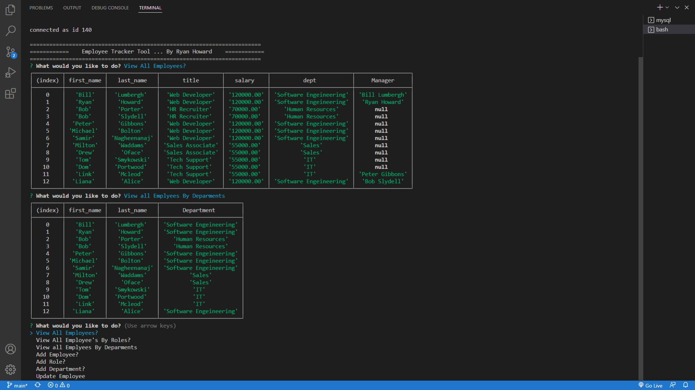

# Employee_Management_Tool

## License

## Table of Contents
- [Project Description](#project-description)  
- [Installation Information](#installation-information)  
- [Usage Information](#usage-information)  
- [Test Instructions](#test-instructions)  
- [Contributors on this Project](#contributors-on-this-project)  
- [Contact Information](#contact-information)  
  
## Project Description
- Developers are often tasked with creating interfaces that make it easy for non-developers to view and interact with information stored in databases. Often these interfaces are known as Content Management Systems. In this homework assignment, your challenge is to architect and build a solution for managing a company's employees using node, inquirer, and MySQL.
  
## Installation Information
- Clone from GitHub
- Type "npm init -y" to create a new .json file.
- Type "npm install" to install the NPM packages -Inquirer, -mysql2, -consol.table.
- Make sure to run .sql files to create the dadabase and seed the data before running server.js so that tables are able to render correctly.
- Run "node index.js" in the Terminal.
- Make sure index.js is connected to SQL before continuing.
  
## Usage Information

- Run through the prompts as to use the application.

- Live Application demo https://youtu.be/fXXflG8nDIw
- 

## Contributors on this Project
- Myself RHoward1
- *[Contribution Guidlines](https://github.com/github/docs/blob/main/CONTRIBUTING.md)*
  
## Test Instructions
- None

## Questions

- If you have any questions about the repo, open an issue or contact me on Github or by Email.
### Contact Information
- Github [RHoward1](https://github.com/RHoward1)
  - Email at ryanmhoward.dev@gmail.com

## License Statement
- This application is covered by the  license.
- Visit [MIT](https://opensource.org/licenses/MIT) for more information.
